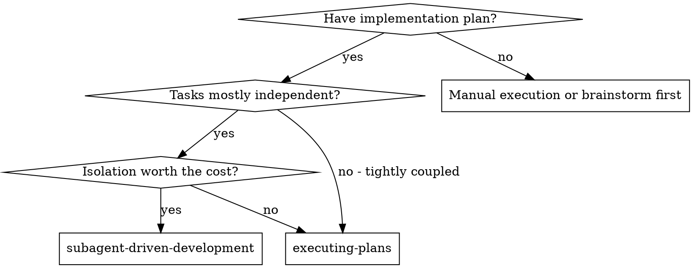
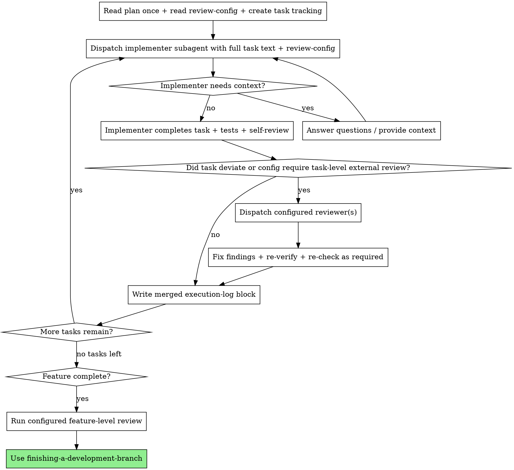

# Subagent-Driven Development

Execute a plan by dispatching fresh subagents for tasks whose isolation is worth the extra cost. This is an optional execution mode, not the default enhanced workflow path.

**Core principle:** Use fresh task isolation only when the payoff is real. Inline execution is the normal path; subagents are for cases where independence, reviewer separation, or context control justifies them.

**Continuous execution:** Do not pause to check in with your human partner between tasks unless blocked, the plan is ambiguous, or all tasks are complete.

## When to Use

**Use this when:**
- tasks are truly independent
- task-local context isolation is valuable
- you want an independent reviewer perspective and it is worth paying for
- the plan explicitly calls for subagent execution

**Prefer `executing-plans` when:**
- tasks are tightly coupled
- the main session already has the needed context
- the plan's lightweight default is sufficient
- you do not need isolated task workers

## Review Config Requirement

Before dispatching any implementer or reviewer subagent:
1. **Read the implementation plan once** at the beginning
2. Read the plan's `review-config.md`
3. Extract the task list from the plan and pass the relevant review-config requirements into each subagent prompt

Subagents must not silently revert to the workflow's old heavy defaults. The controller must tell them:
- whether task-level external review is on or off
- whether feature-level review is deferred to the end
- whether escalation is required due to deviation

If a task uses two-stage external review, **spec compliance review comes first and code quality review comes second**. Do not start code quality review before spec compliance concerns are resolved.

## The Process

## Model Selection

Use the least powerful model that can handle each role to conserve cost and increase speed.

- **Mechanical implementation tasks** → cheap/fast model
- **Integration and judgment tasks** → standard model
- **Architecture and independent review tasks** → most capable available model

## Handling Implementer Status

Implementer subagents report one of four statuses. Handle each appropriately:

**DONE:** Proceed according to review-config.

**DONE_WITH_CONCERNS:** Read the concerns before deciding whether to review or escalate.

**NEEDS_CONTEXT:** Provide the missing context and re-dispatch.

**BLOCKED:** Assess the blocker:
1. context problem → provide more context and retry
2. task requires more reasoning → upgrade model
3. task too large → split it further
4. plan itself wrong → escalate to the human partner

## Prompt Templates

- `./implementer-prompt.md` — Dispatch implementer subagent
- `./spec-reviewer-prompt.md` — Dispatch spec compliance reviewer subagent when config or deviation requires it
- `./code-quality-reviewer-prompt.md` — Dispatch code quality reviewer subagent when config or feature-level review requires it

## Key Rules

- Read the plan once at the beginning
- Provide full task text directly to subagents; do not make them read files
- Implementers must run the plan's Step 5 self-checklist verbatim (the 6 items shipped with each task) and produce `✅`/`❌`/`N/A` per item before reporting back; any `❌` returns `BLOCKED` instead of `DONE`
- Respect the review-config instead of assuming two-stage review for every task
- If task-level external review is configured off, only run the self-checklist unless deviation escalation applies
- Feature-level review still runs later if configured
- Never start implementation on main/master branch without explicit user consent

## Red Flags

**Never:**
- present this skill as the default path when inline execution would do
- ignore `review-config.md`
- dispatch multiple implementation subagents in parallel against the same working tree
- make subagents read the plan file instead of giving them the extracted task text
- silently skip configured review or escalation behavior
- assume every task must go through the same heavy two-stage review loop

**If reviewer finds issues:**
- the implementer fixes the issues
- re-verify before re-check
- prefer the original reviewer when that continuity matters
- use a fresh reviewer only when the original reviewer is unavailable or lacks context even after recap

## Integration

**Required workflow skills:**
- **superpowers:using-git-worktrees** — Ensures isolated workspace when requested
- **superpowers:writing-plans** — Creates the plan and review-config this skill executes
- **superpowers:requesting-code-review** — Used when an external review cycle is configured
- **superpowers:finishing-a-development-branch** — Completes development after all tasks

**Alternative workflow:**
- **superpowers:executing-plans** — Default inline execution path
