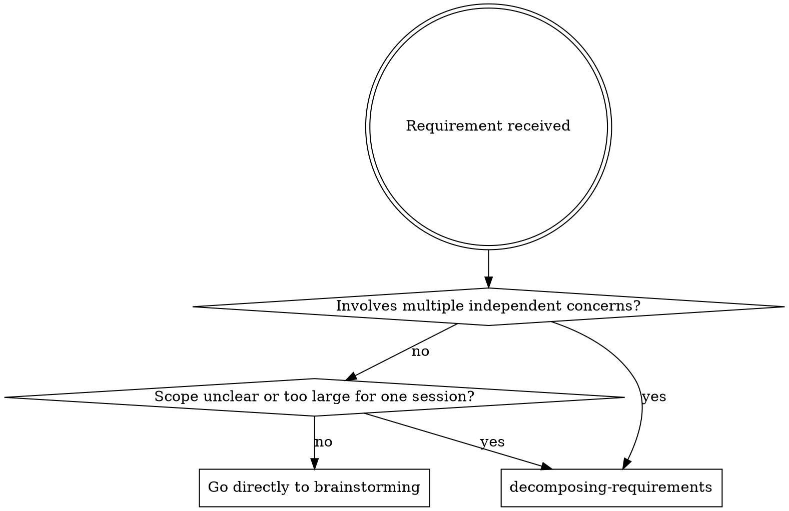

# Decomposing Requirements

Break large or ambiguous requirements into well-scoped, independently deliverable sub-projects before any design work begins.

**Core principle:** You propose the structure, your human partner decides what to build and in what order. Your job is to make the decomposition visible so they can make informed choices.

**Announce at start:** "I'm using the decomposing-requirements skill to break down this requirement."

## Auto-Init

If `docs/superpowers/` does not exist in the project, create it before saving:

```bash
mkdir -p docs/superpowers/{decomposition,specs,plans,execution-log,debugging-log,review-log,completion}
```

Also check if `docs/superpowers/README.md` exists. If not, copy the template:

```bash
cp ~/.claude/skills/using-enhanced-workflow/docs-superpowers-README-template.md docs/superpowers/README.md
```

## When to Use



**Use when:**
- Requirement mentions 3+ distinct features or subsystems
- Request is vague ("build a platform", "redesign the system")
- You're unsure where to start
- User asks "how should we approach this?"
- Brainstorming skill flags that the project needs decomposition

**Don't use when:**
- Single, well-scoped feature or bugfix
- Requirement fits in one brainstorming session

## Checklist

Create a task for each item and complete in order:

1. **Restate the requirement** — in your own words, confirm with your human partner
2. **Identify concerns** — list distinct functional areas or subsystems, confirm or adjust with your human partner
3. **Early exit check** — if analysis reveals this is actually a single concern with clear scope, stop and invoke brainstorming directly
4. **Map dependencies** — which sub-projects depend on which, what can run in parallel
5. **Check for circular dependencies** — if A depends on B and B depends on A, extract the shared dependency into its own sub-project or merge A and B
6. **Identify risks and unknowns** — per sub-project, flag anything unclear or potentially complex (NOT size estimates)
7. **Propose execution order** — recommend sequence with rationale
8. **Human partner decides** — present the decomposition, let them choose:
   - Which sub-projects to do now vs later vs skip
   - Priority order
9. **Save decomposition doc** — to project docs (default: `docs/superpowers/decomposition/YYYY-MM-DD-<topic>.md`, adjust to project conventions)
10. **Transition** — for the first chosen sub-project, invoke brainstorming skill with the sub-project's scope and exclusions as context

## Re-prioritization

After completing any sub-project, check with your human partner:
- Does the remaining priority order still make sense?
- Any new information that changes dependencies?
- Any sub-projects to add, remove, or merge?

If priorities change, update the decomposition doc with the new order and rationale.

## State Ownership

The decomposition document is maintained by the **main session**, not automatically by downstream documenting skills.

Update the decomposition doc when:
- a sub-project becomes active
- a sub-project completes
- a sub-project is deferred or skipped
- dependency order changes
- the recommended next sub-project changes

The decomposition document is the macro-level map. Detailed execution, review, debugging, and completion records still belong to each sub-project's own artifact chain.

## Decomposition Output

Start the saved decomposition document with a quick-scan status map:

```markdown
## Sub-project Overview

| Sub-project | Status | Priority | Dependencies | Next Step |
|---|---|---|---|---|
| [Name] | Pending | 1 | — | Start brainstorming |
```

Then describe each sub-project in detail.

Each sub-project should specify:

| Field | Description |
|-------|-------------|
| **Name** | Short, descriptive name |
| **Status** | `Pending`, `In Progress`, `Blocked`, `Completed`, `Deferred`, or `Skipped` |
| **Priority** | Relative execution order chosen with your human partner |
| **Goal** | One sentence — what it delivers |
| **Scope** | What's included and explicitly excluded |
| **Dependencies** | Which other sub-projects must complete first |
| **Risks** | Unknowns, technical challenges, external dependencies |
| **Deliverable** | What the human partner gets when it's done |
| **Next Step** | What should happen next for this sub-project |

## Dependency Visualization

Present as a simple directed graph so your human partner can see the critical path:

```
A ──→ B ──→ D
       ╲
        ╲──→ C ──→ E
```

Independent chains can be parallelized. Highlight the critical path.

## Handoff to Brainstorming

When transitioning, provide the brainstorming skill with:
- The sub-project's **name and goal**
- Its **scope boundaries** (included and excluded)
- Any **constraints** from the decomposition (e.g., must use API from sub-project A)

This ensures brainstorming doesn't re-explore what decomposition already decided.

## Key Principles

- **Human partner holds the pen** — you propose structure, they decide
- **Explicit boundaries** — every sub-project has a clear "done" state
- **No gold-plating** — only decompose what's actually needed
- **YAGNI at the macro level** — sub-projects that aren't needed get cut, not deferred
- **One question at a time** — don't overwhelm with a form to fill out
- **Honest about unknowns** — flag what you don't know, don't fake estimates

## Red Flags

| Thought | Reality |
|---------|---------|
| "This is small enough to skip decomposition" | Multiple concerns = multiple sub-projects, regardless of perceived size |
| "I can just start brainstorming the first piece" | Without decomposition, you'll miss dependencies and rework |
| "Let me just plan the whole thing as one" | Large plans fail. Small plans succeed. Decompose first. |
| "The human partner will figure out the order" | Your job is to make the structure visible. Do it. |
| "Dependencies don't matter for planning" | Wrong order = blocked tasks = wasted time. |
| "I can estimate complexity accurately" | Without design, estimates are guesses. Flag risks instead. |
| "Forcing a split to justify using this skill" | If it's really one concern, exit early and go to brainstorming. |

## After Decomposition

**The terminal state is invoking brainstorming.** For the first chosen sub-project, invoke brainstorming skill. Each sub-project goes through its own brainstorming → spec → plan → execution cycle.

Do NOT attempt to brainstorm all sub-projects at once. One at a time.
